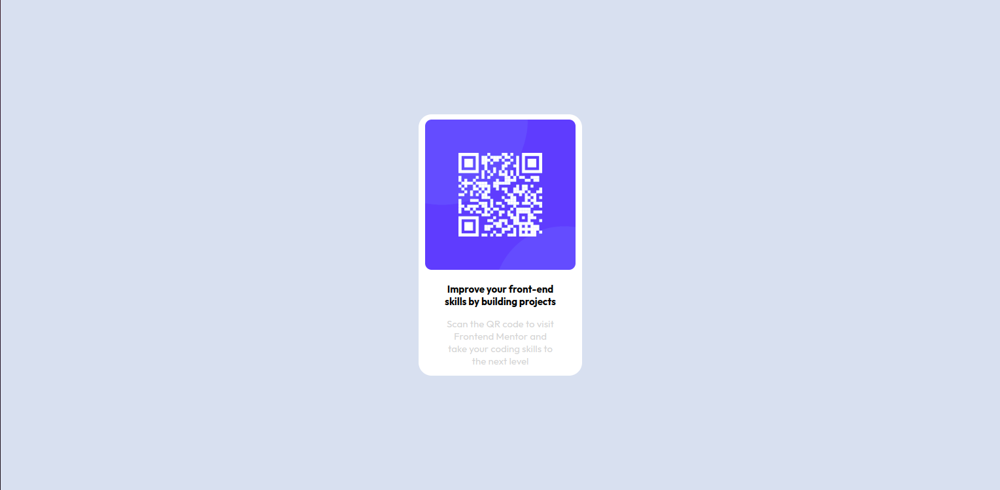

# Frontend Mentor - QR code component

# QR Code Component

This is a simple QR Code Component built with HTML and CSS. It displays a QR code image with a description below it. The project is hosted [here](https://qr-code-component-psi-one.vercel.app/).
